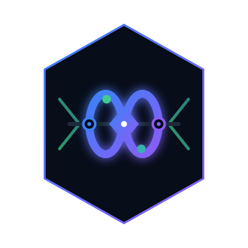
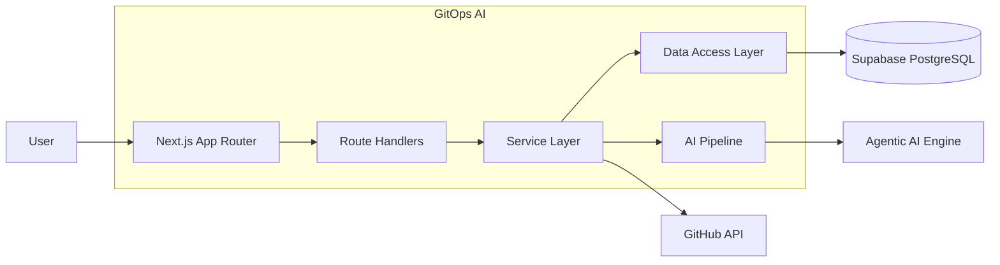
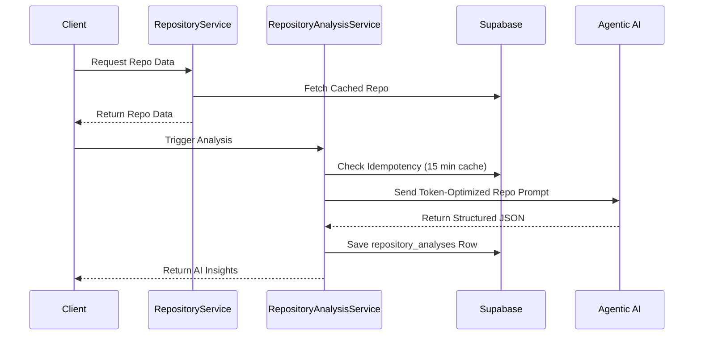
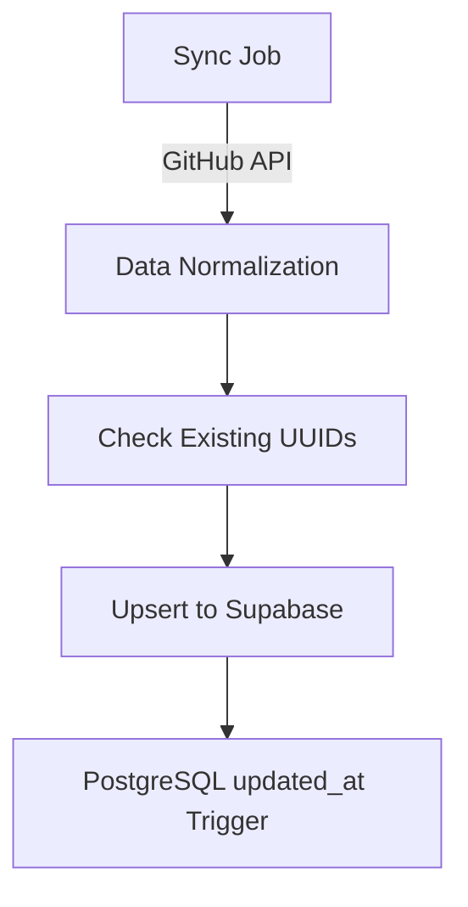
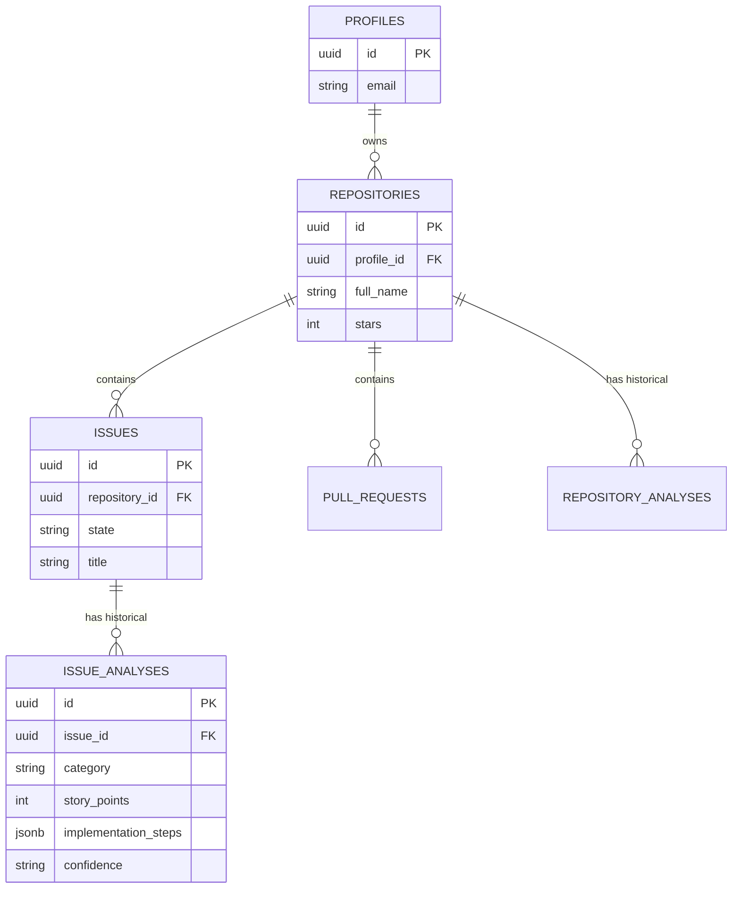

<div align="center">
  
  <h1>GitOps AI</h1>

  <p><strong>AI-Powered GitHub Intelligence Platform for Engineering Teams</strong></p>

  <p>
    <a href="https://nextjs.org"></a>
    <a href="https://supabase.com"></a>
    
    <a href="https://www.typescriptlang.org"></a>
    <a href="https://tailwindcss.com"></a>
  </p>
</div>

---

GitOps AI bridges the gap between raw Git data and actionable engineering strategy. By deeply integrating with GitHub, it extracts repository states, issue metadata, and pull requests, feeding them through an optimized Agentic AI pipeline to deliver **Repository Intelligence**, **Issue Intelligence**, and transparent **DevOps Visibility**.

## Key Features

### Repository Intelligence
Assess the systemic health of projects before diving into the code.
- **Health Scoring**: Classifies repositories into lifecycle stages (e.g., Active, Dormant).
- **Risk Analysis**: Identifies architectural, structural, and dependency risks.
- **AI Recommendations**: Provides actionable intelligence to improve repository maintenance.
- **Evidence-Based Insights**: Grounds AI findings in actual repository metadata and commit frequencies.

### Issue Intelligence V2
Stop guessing scope. Start engineering.
- **Priority Classification**: Deterministic parsing of bug vs. feature vs. refactor.
- **Complexity Estimation**: Predicts the architectural footprint of an issue.
- **Risk Assessment**: Evaluates the potential blast radius.
- **Story Point Generation**: Deterministically maps complexity to agile story points (1, 2, 3, 5, 8).
- **Acceptance Criteria Generation**: Creates 2-5 testable conditions for issue resolution.
- **Implementation Planning**: Maps out short, actionable technical steps.
- **Blocker Detection**: Highlights implicit blockers identified within issue comments.

### Engineering Analytics
*Current*: Deep dive views into individual repositories and issues via a high-performance Next.js dashboard.
*Future*: Aggregated organizational metrics spanning PR velocity, developer throughput, and predictive risk indicators.

---

## Architecture

### System Architecture



### Repository Analysis Flow



### Data Persistence Flow



---

## System Design

- **Frontend Layer**: Built with **Next.js (App Router)** utilizing Server Components for optimal initial load times and parallel data fetching. Styled with **Tailwind CSS** implementing a dark-theme, professional SaaS aesthetic.
- **Backend Layer**: **Next.js Route Handlers** serve as lightweight API controllers passing requests securely to the **Service Layer** (e.g., `issue.service.ts`). Business logic is strictly separated from presentation and HTTP routing.
- **Data Layer**: **Supabase PostgreSQL** provides durable storage. The architecture uses the Repository pattern (`.repository.ts` files) to abstract database queries, relying on **Row Level Security (RLS)** to enforce tenant data isolation.
- **AI Layer**: A unified **AI Client** (`gemini.ts`) handles API resilience, JSON parsing, and schema validation.
- **Integration Layer**: The system integrates natively with the **GitHub REST API** for entity synchronization, updating records efficiently.

---

## Technology Stack

| Domain | Technology | Purpose |
|--------|------------|---------|
| **Frontend** | Next.js 15, React 19, Tailwind CSS v4 | Server-rendered UI, component architecture, styling |
| **Backend** | Next.js API Routes, Node.js | API endpoints, secure service orchestration |
| **Database** | Supabase, PostgreSQL | Relational data, RLS, Edge Functions (Auth) |
| **Authentication**| Supabase Auth, `@supabase/ssr` | Secure, cookie-based session management |
| **AI** | Agentic AI, Zod | Generative intelligence, strict JSON output validation |
| **DevOps** | ESLint, TypeScript | Static typing, code quality, standard enforcement |

---

## Database Design



---

## AI Architecture

### Repository Intelligence Engine
- **Inputs**: Repo metadata, language distribution, GitHub creation and push dates.
- **Prompt Strategy**: Strictly instructed to evaluate lifecycle stages (incubation, mature, stale) and generate actionable recommendations rather than generic summaries.
- **Output**: JSON payload outlining findings, structural risks, and prioritized recommendations.

### Issue Intelligence Engine (V2)
- **Classification**: Categorizes issues (bug, feature, refactor, ci_cd) and rates priority, complexity, and risk.
- **Story Point Estimation**: Deterministically maps AI-assessed complexity to standard agile story points (1, 2, 3, 5, 8).
- **Implementation Planning**: Generates 2-5 concise implementation steps and acceptance criteria conditions.

### Confidence Scoring System
*GitOps AI does not trust LLMs to grade their own homework.* Confidence (`low`, `medium`, `high`) is calculated **deterministically** by analyzing the density of the source data (body length, comment count, label count) and the diversity of the evidence extracted by the AI.

### Structured Output Pipeline
```
Agentic AI -> application/json -> JSON.parse() -> Zod validation -> Persistence Layer
```
If the AI hallucinates keys or deviates from bounded arrays (e.g., providing 10 steps instead of the requested max of 5), Zod rejects the payload, preventing bad data from entering the database.

---

## Security & Reliability

- **Schema Validation**: All AI inputs and outputs are validated at runtime using `Zod`.
- **Type Safety**: End-to-end TypeScript enforcement. `tsc --noEmit` is required for CI.
- **Input Sanitization**: Prompts utilize a `sanitize()` function to strip role-play directives, system overrides, and control characters to resist Prompt Injection attacks.
- **Idempotency**: Services employ a 15-minute caching window for AI analyses to prevent API spam and reduce AI inference costs.
- **Data Isolation**: Supabase Row Level Security ensures users can only read, sync, and analyze repositories tied to their authenticated Profile ID.

---

## Project Structure

```text
gitops-ai/
├── src/
│   ├── app/                 # Next.js App Router (Pages & APIs)
│   │   ├── (dashboard)/     # Authenticated views
│   │   ├── api/             # REST Route handlers
│   │   └── login/           # Authentication flow
│   ├── components/          # Reusable React components
│   │   ├── auth/
│   │   ├── issues/
│   │   ├── pull-requests/
│   │   ├── repositories/
│   │   └── ui/
│   ├── lib/                 # Core logic and integrations
│   │   ├── ai/              # Gemini config, Prompts, Schemas, Scoring
│   │   ├── repositories/    # Supabase data access layer
│   │   ├── services/        # Business logic orchestration
│   │   └── supabase/        # Database client instantiation
│   └── types/               # Global TypeScript definitions
├── supabase/
│   └── migrations/          # Incremental SQL schema changes
└── public/
```

---

## API Reference

| Method | Endpoint | Purpose |
|--------|----------|---------|
| `GET`  | `/api/repositories` | Retrieve a list of synced repositories for the user. |
| `POST` | `/api/repositories` | Sync a single repository by GitHub URL or Name. |
| `POST` | `/api/repositories/sync` | Trigger a bulk synchronization job. |
| `POST` | `/api/repositories/[id]/analyze` | Trigger Agentic AI to generate a new Repository Health Analysis. |
| `GET`  | `/api/repositories/[id]/analysis` | Fetch the latest cached Repository Analysis. |
| `GET`  | `/api/issues` | Retrieve synced issues across repositories. |
| `POST` | `/api/issues/[id]/analyze` | Trigger Agentic AI to generate an Issue Intelligence V2 Analysis. |
| `GET`  | `/api/issues/[id]/analysis` | Fetch the latest cached Issue Analysis. |

---

## Performance Characteristics

- **Parallel Loading**: Detail pages use `Promise.allSettled` to fetch repository metadata and AI analyses concurrently, ensuring the UI remains responsive even if the AI cache misses.
- **Token Optimization**: AI prompts are aggressively truncated (e.g., Issue bodies limited to 1200 chars). Extraneous metadata is stripped before reaching the AI engine.
- **Validation Overhead**: Zod is used precisely at system boundaries (API ingestion, AI output) keeping the hot-path within the service layer fast and typesafe.

---

## Current Status

### Production Ready
- Supabase Authentication (Email/Password).
- GitHub Entity Synchronization (Repositories & Issues).
- Repository Intelligence (Health Scoring).
- Issue Intelligence V2 (Classification & Planning).
- Dark Mode SaaS UI.

### In Progress
- Pull Request synchronization pipeline (Database layer implemented, UI pending).

### Known Limitations
- AI API is subject to rate limiting; retries currently throw standard UI errors.
- Issue syncing is currently limited to top 50 recent issues to preserve API quota.

---

## Roadmap

### Completed
- [x] Database architecture and RLS policies
- [x] Repository Intelligence
- [x] Issue Intelligence V2

### Planned
- [ ] **PR Intelligence**: AI-assisted code review summaries and risk flagging.
- [ ] **Sprint Planning AI**: Automated sprint suggestions based on story point capacity.
- [ ] **Roadmap Intelligence**: Mapping issues to higher-level epics.
- [ ] **Engineering Analytics Dashboard**: Burn-down charts and velocity tracking.
- [ ] **Predictive Risk Analysis**: Correlating PR complexity with historical bug rates.

---

## Screenshots

*(Replace placeholders with actual images)*


*GitOps AI Repository Dashboard*


*V2 Issue Intelligence Engineering Scorecard*

---

## Why This Project Matters

**For Engineering Leaders & Hiring Managers:**
GitOps AI is not a trivial wrapper around an LLM. It demonstrates deep architectural maturity, showcasing:
- **Full Stack Engineering**: Seamless integration of a Next.js App Router frontend with a secure, service-oriented Node backend.
- **System Design**: Clear boundaries between HTTP handlers, business logic, data access, and third-party APIs.
- **AI Engineering**: Moving beyond chatbots to structured, deterministic, and schema-validated AI outputs embedded directly into business workflows.
- **Database Design**: Relational integrity, cascade deletions, and robust Row Level Security in PostgreSQL.
- **Product Thinking**: Focusing on "Engineering Intelligence" rather than generic AI text generation, addressing real-world DevOps visibility problems.

---

## Local Setup

1. **Clone the repository:**
   ```bash
   git clone https://github.com/yourusername/gitops-ai.git
   cd gitops-ai
   ```

2. **Install dependencies:**
   ```bash
   npm install
   ```

3. **Set up environment variables:**
   ```bash
   cp .env.local.example .env.local
   # Populate with your Supabase, GitHub, and Gemini keys
   ```

4. **Run development server:**
   ```bash
   npm run dev
   ```

## Environment Variables

Required variables in `.env.local`:
```env
NEXT_PUBLIC_SUPABASE_URL=your_supabase_url
NEXT_PUBLIC_SUPABASE_ANON_KEY=your_supabase_anon_key
GEMINI_API_KEY=your_agentic_ai_api_key
```

## Contribution Guide

1. Fork the Project.
2. Create your Feature Branch (`git checkout -b feature/AmazingFeature`).
3. Ensure types pass (`npm run build` or `npx tsc --noEmit`).
4. Ensure linting passes (`npm run lint`).
5. Commit your Changes (`git commit -m 'Add some AmazingFeature'`).
6. Push to the Branch (`git push origin feature/AmazingFeature`).
7. Open a Pull Request.
