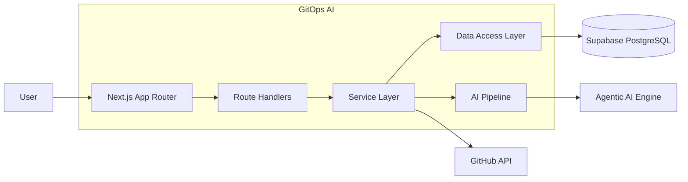
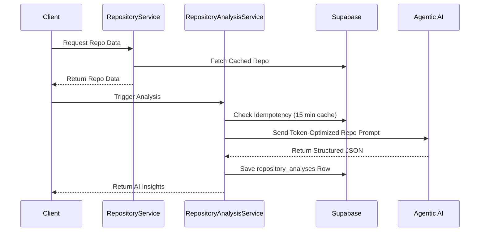
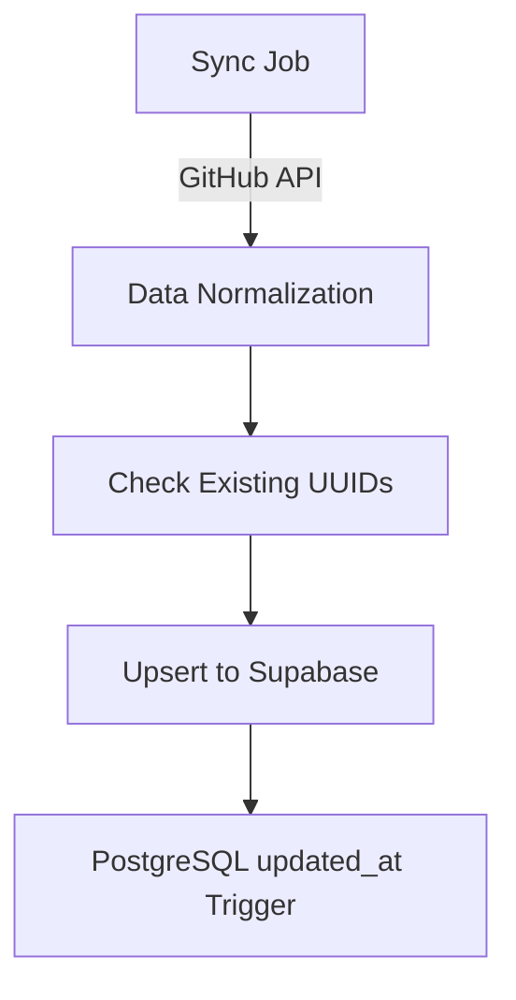
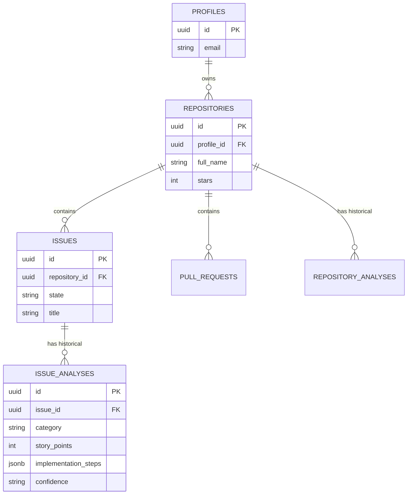

<div align="center">
  
  <h1>GitOps AI</h1>

  <p><strong>AI-Powered GitHub Intelligence Platform for Engineering Teams</strong></p>

  <p>
    <a href="https://nextjs.org"></a>
    <a href="https://supabase.com"></a>
    
    <a href="https://www.typescriptlang.org"></a>
    <a href="https://tailwindcss.com"></a>
    
  </p>
</div>

---

## TL;DR

GitOps AI is a **production-ready, full-stack SaaS platform** that turns raw GitHub data into actionable engineering intelligence using a structured AI pipeline. Built with Next.js 15, Supabase, and Gemini AI. It goes well beyond a standard AI wrapper by implementing **deterministic confidence scoring**, **Zod-validated AI outputs**, and a **multi-layer service architecture**.

> Built to solve a critical engineering bottleneck: teams lose countless hours manually triaging issues, estimating complexity, and assessing repository health. GitOps AI automates this entirely.

> **Project Status**: The core platform is fully functional and deployed. The system is currently being extended to support LangGraph multi-agent orchestration and predictive risk analytics.

---

GitOps AI bridges the gap between raw Git data and actionable engineering strategy. By deeply integrating with GitHub, the platform extracts repository states, issue metadata, and pull requests, feeding them through an optimized Agentic AI pipeline to deliver **Repository Intelligence**, **Issue Intelligence**, and transparent **DevOps Visibility**.

## Key Features

### Repository Intelligence
Assess the systemic health of projects prior to code review.
* **Health Scoring**: Classifies repositories into distinct lifecycle stages (Incubating, Active, Maturing, Stale, Dormant).
* **Risk Analysis**: Identifies architectural, structural, and dependency risks using evidence-backed reasoning.
* **AI Recommendations**: Delivers actionable intelligence to improve repository maintenance, bypassing generic summaries.
* **Evidence-Based Insights**: Grounds all AI findings in real repository metadata and commit frequencies.

### Issue Intelligence V2
Eliminate scope ambiguity and accelerate engineering velocity.
* **Priority Classification**: Deterministic parsing of bug, feature, refactor, and ci_cd issues.
* **Complexity Estimation**: Predicts the architectural footprint and blast radius of an issue.
* **Story Point Generation**: Deterministically maps AI-assessed complexity to standard Fibonacci story points (1, 2, 3, 5, 8).
* **Acceptance Criteria Generation**: Creates 2 to 5 testable, concrete conditions for issue resolution.
* **Implementation Planning**: Maps out concise, ordered technical steps for execution.
* **Blocker Detection**: Surfaces implicit blockers buried within issue comments.

### Engineering Analytics
* **Current**: Deep-dive views into individual repositories and issues via a high-performance Next.js dashboard.
* **Planned**: Aggregated organizational metrics including PR velocity, developer throughput, and predictive risk indicators.

---

## Architecture

### System Architecture



### Repository Analysis Flow



### Data Persistence Flow



---

## System Design

* **Frontend Layer**: Built with **Next.js 15 (App Router)** utilizing Server Components for optimal initial load times and parallel data fetching via `Promise.allSettled`. Styled with **Tailwind CSS** to implement a professional dark-theme SaaS aesthetic.
* **Backend Layer**: **Next.js Route Handlers** serve as lightweight API controllers, passing requests securely to a dedicated **Service Layer** (`issue.service.ts`, `repository-analysis.service.ts`). Business logic is strictly separated from HTTP routing and presentation.
* **Data Layer**: **Supabase PostgreSQL** provides durable relational storage. The architecture utilizes the Repository pattern (`.repository.ts` files) to fully abstract database queries, with **Row Level Security (RLS)** enforcing tenant data isolation at the database level.
* **AI Layer**: A unified **AI Client** (`gemini.ts`) handles API resilience, structured JSON parsing, and Zod schema validation, ensuring no hallucinated or malformed AI outputs can reach the database.
* **Integration Layer**: Native integration with the **GitHub REST API** enables efficient entity synchronization via idempotent upserts.

---

## Technology Stack

| Domain | Technology | Purpose |
|--------|------------|---------|
| **Frontend** | Next.js 15, React 19, Tailwind CSS v4 | Server-rendered UI, component architecture, styling |
| **Backend** | Next.js API Routes, Node.js | API endpoints, secure service orchestration |
| **Database** | Supabase, PostgreSQL | Relational data, RLS, Edge Functions (Auth) |
| **Authentication** | Supabase Auth, `@supabase/ssr` | Secure, cookie-based session management |
| **AI** | Agentic AI (Gemini), Zod | Generative intelligence, strict JSON output validation |
| **DevOps** | ESLint, TypeScript (`tsc --noEmit`) | Static typing, code quality, standard enforcement |

---

## Database Design



---

## AI Architecture

### Repository Intelligence Engine
* **Inputs**: Repo metadata, language distribution, GitHub creation and last-push dates.
* **Prompt Strategy**: Strictly instructed to evaluate lifecycle stages (incubation, mature, stale) and generate actionable recommendations rather than generic text summaries.
* **Output**: Validated JSON payload outlining findings, structural risks, and prioritized recommendations.

### Issue Intelligence Engine (V2)
* **Classification**: Categorizes issues (bug, feature, refactor, ci_cd) and rates priority, complexity, and risk on a bounded scale.
* **Story Point Estimation**: Deterministically maps AI-assessed complexity to standard Fibonacci story points (1, 2, 3, 5, 8).
* **Implementation Planning**: Generates 2 to 5 concise, ordered implementation steps and concrete acceptance criteria.

### Confidence Scoring System
> *GitOps AI does not trust LLMs to grade their own homework.*

Confidence (`low`, `medium`, `high`) is calculated **deterministically** by analyzing the density of source data (body length, comment count, label count) and the diversity of evidence extracted by the AI, independent of the LLM's self-reported certainty.

### Structured Output Pipeline
```
Agentic AI -> application/json -> JSON.parse() -> Zod validation -> Persistence Layer
```
If the AI hallucinates keys or deviates from bounded arrays (e.g., providing 10 steps instead of the max of 5), **Zod rejects the payload**, preventing malformed data from entering the database.

---

## Security & Reliability

| Concern | Implementation |
|---------|---------------|
| **AI Output Safety** | All AI outputs are validated at runtime using `Zod` schemas. Malformed outputs are immediately rejected. |
| **Prompt Injection** | A `sanitize()` function strips role-play directives, system overrides, and control characters. |
| **Idempotency** | A 15-minute caching window prevents API spam and reduces AI inference costs. |
| **Data Isolation** | Supabase Row Level Security ensures users can only access their own repositories. |
| **Type Safety** | End-to-end TypeScript enforcement. `tsc --noEmit` is required before any commit. |

---

## Performance Characteristics

* **Parallel Loading**: Detail pages use `Promise.allSettled` to fetch repository metadata and AI analyses concurrently. The UI remains responsive even on AI cache misses.
* **Token Optimization**: AI prompts are aggressively trimmed (e.g., issue bodies capped at 1200 chars). Extraneous metadata is stripped before reaching the AI engine.
* **Validation Overhead**: Zod runs exclusively at system boundaries (API ingestion, AI output), keeping the hot-path within the service layer fast and fully type-safe.

---

## Project Structure

```text
gitops-ai/
├── src/
│   ├── app/                 # Next.js App Router (Pages & APIs)
│   │   ├── (dashboard)/     # Authenticated views
│   │   ├── api/             # REST Route handlers
│   │   └── login/           # Authentication flow
│   ├── components/          # Reusable React components
│   │   ├── auth/
│   │   ├── issues/
│   │   ├── pull-requests/
│   │   ├── repositories/
│   │   └── ui/
│   ├── lib/                 # Core logic and integrations
│   │   ├── ai/              # Gemini config, Prompts, Schemas, Scoring
│   │   ├── repositories/    # Supabase data access layer
│   │   ├── services/        # Business logic orchestration
│   │   └── supabase/        # Database client instantiation
│   └── types/               # Global TypeScript definitions
├── supabase/
│   └── migrations/          # Incremental SQL schema changes
└── public/
```

---

## API Reference

| Method | Endpoint | Purpose |
|--------|----------|---------|
| `GET`  | `/api/repositories` | Retrieve synced repositories for the authenticated user |
| `POST` | `/api/repositories` | Sync a repository by GitHub URL or name |
| `POST` | `/api/repositories/sync` | Trigger a bulk synchronization job |
| `POST` | `/api/repositories/[id]/analyze` | Trigger AI to generate a new Repository Health Analysis |
| `GET`  | `/api/repositories/[id]/analysis` | Fetch the latest cached Repository Analysis |
| `GET`  | `/api/issues` | Retrieve synced issues across all repositories |
| `POST` | `/api/issues/[id]/analyze` | Trigger AI to generate an Issue Intelligence V2 Analysis |
| `GET`  | `/api/issues/[id]/analysis` | Fetch the latest cached Issue Analysis |

---

## Current Status

### Fully Implemented
* **Supabase Authentication**: Email/Password login with secure cookie-based session management.
* **GitHub Entity Synchronization**: Repositories, Issues, and Pull Requests synced via idempotent upserts.
* **Repository Intelligence**: AI health scoring, lifecycle classification, risk analysis, and prioritized recommendations.
* **Issue Intelligence V2**: Full classification, complexity estimation, story point generation, acceptance criteria, implementation planning, and blocker detection.
* **Roadmap Intelligence**: AI-generated sprint planning and issue-to-epic mapping.
* **Dark Mode SaaS UI**: Responsive Next.js App Router dashboard with professional design.
* **Database Architecture**: Full PostgreSQL schema with RLS policies, triggers, and incremental migrations.

### Actively Building (4 Phases Remaining)
1. **PR Intelligence**: AI-assisted code review summaries and merge risk flagging.
2. **Engineering Analytics Dashboard**: Burn-down charts, PR velocity, and developer throughput metrics.
3. **Predictive Risk Analysis**: Correlating PR complexity with historical defect rates.
4. **LangGraph Multi-Agent Orchestration**: Replacing single-prompt AI calls with a stateful, multi-step agentic pipeline.

### Known Limitations
* AI API is subject to rate limiting. Retries currently surface standard UI errors.
* Issue syncing is capped at 50 most recent issues to preserve API quota.

---

## Roadmap

### Completed
* [x] Database architecture, RLS policies, and migration pipeline
* [x] Supabase Auth with secure session management
* [x] GitHub Entity Synchronization (Repos, Issues, PRs)
* [x] Repository Intelligence (Health Scoring & Risk Analysis)
* [x] Issue Intelligence V2 (Classification, Estimation & Planning)
* [x] Roadmap Intelligence (AI Sprint Planning)
* [x] Dark Mode SaaS Dashboard UI

### In Progress
* [ ] **PR Intelligence**: AI-assisted code review summaries and merge risk flagging
* [ ] **Engineering Analytics Dashboard**: Burn-down charts, velocity tracking, and throughput metrics
* [ ] **Predictive Risk Analysis**: Correlating PR complexity with historical bug rates
* [ ] **LangGraph Multi-Agent Orchestration**: Stateful, graph-based agentic pipeline replacing single-prompt flows

---

## Why This Project Matters

> **For Engineering Leaders & Hiring Managers:**

GitOps AI is not a trivial LLM wrapper. It demonstrates architectural maturity across the full stack:

* **Full Stack Engineering**: Next.js App Router frontend with a clean, service-oriented Node.js backend to ensure proper separation of concerns at every layer.
* **System Design**: Clear boundaries between HTTP handlers, business logic, data access, and third-party APIs. Designed to scale.
* **AI Engineering**: Moving beyond chatbots to **structured, deterministic, and schema-validated AI outputs** embedded directly into business workflows. The confidence scoring system is calculated independently of the LLM as a deliberate engineering choice.
* **Database Design**: Relational integrity, cascade deletions, PostgreSQL triggers, and Row Level Security.
* **Security Mindset**: Prompt injection mitigation, runtime schema validation, and tenant isolation are first-class concerns.
* **Product Thinking**: Solving a real DevOps visibility problem rather than building a generic AI demo.

---

## Technical Highlights

Critical engineering decisions made during development:

| Decision | Rationale |
|----------|-----------|
| **Deterministic confidence scoring** | LLMs should not self-grade. Confidence is computed from data density, not LLM output. |
| **Zod at system boundaries only** | Prevents performance overhead while guaranteeing type-safety where it matters most. |
| **Repository pattern for DAL** | Abstracts Supabase queries, making the service layer testable and database-agnostic. |
| **`Promise.allSettled` for parallel fetching** | Dashboard stays responsive even when AI cache misses. Partial failures do not block the UI. |
| **Token-optimized prompts** | Aggressive truncation reduces inference cost and latency without sacrificing output quality. |
| **Idempotent sync jobs** | GitHub sync uses UUID checks and upserts. Safe to re-run without duplicating data. |

---

## Local Setup

1. **Clone the repository:**
   ```bash
   git clone https://github.com/amitwaghmare888/GitOps-AI.git
   cd gitops-ai
   ```

2. **Install dependencies:**
   ```bash
   npm install
   ```

3. **Set up environment variables:**
   ```bash
   cp .env.local.example .env.local
   # Populate with your Supabase, GitHub, and Gemini API keys
   ```

4. **Run the development server:**
   ```bash
   npm run dev
   ```

## Environment Variables

Required variables in `.env.local`:
```env
NEXT_PUBLIC_SUPABASE_URL=your_supabase_url
NEXT_PUBLIC_SUPABASE_ANON_KEY=your_supabase_anon_key
GEMINI_API_KEY=your_agentic_ai_api_key
```

## Contribution Guide

1. Fork the project.
2. Create your feature branch: `git checkout -b feature/AmazingFeature`
3. Ensure types pass: `npx tsc --noEmit`
4. Ensure linting passes: `npm run lint`
5. Commit your changes: `git commit -m 'Add some AmazingFeature'`
6. Push to the branch: `git push origin feature/AmazingFeature`
7. Open a Pull Request.
